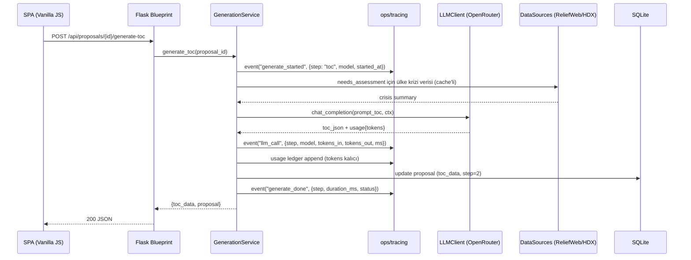
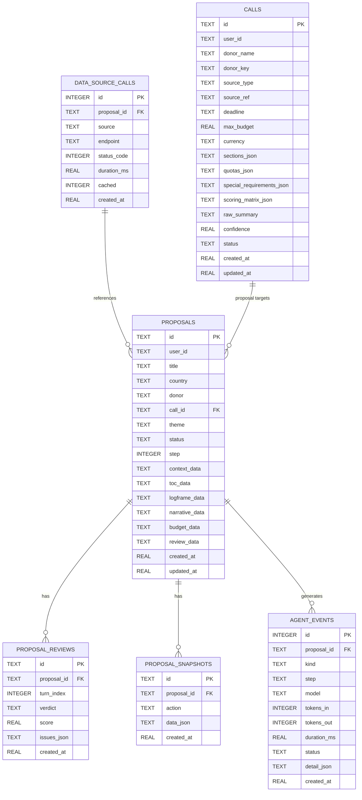
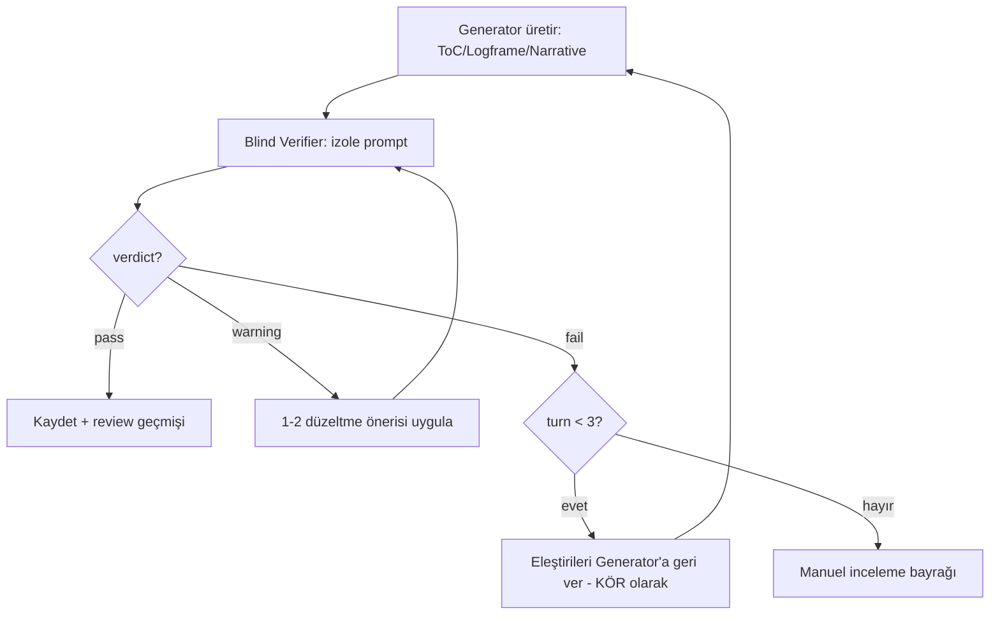
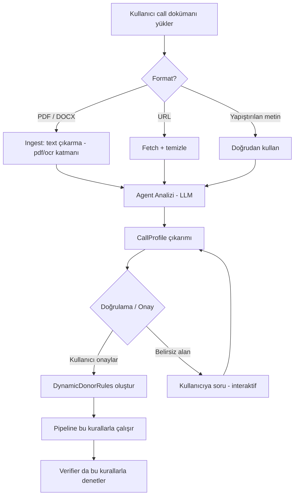

# Proposal — Backend Design (Hedef Mimari)

> Bu doküman proposal sisteminin **hedef backend mimarisini** tanımlar.
> Mevcut iskelet (Faz 0-1) bu tasarıma kademeli olarak evrilecektir.
> İlkeler: Sightline bağımsızlığı + reliefweb_api uyumluluğu + Waku LLM-Ops deseni.

---

## 1. Mimari Genel Bakış

```
┌─────────────────────────────────────────────────────────────────────┐
│                         PRESENTATION (API)                          │
│  blueprints/proposal_api.py  ·  validation · rate limit · errors    │
├─────────────────────────────────────────────────────────────────────┤
│                        APPLICATION (SERVICES)                       │
│  Pipeline orchestrator · GenerateToC · Verify · Advisor · Export    │
│  (iş kurallarını domain'den çağırır, DB + LLM + ops'ı koordine eder)│
├─────────────────────────────────────────────────────────────────────┤
│                           DOMAIN (ENGINE)                           │
│  donor_rules · generator · verifier · advisor  (saf iş mantığı)     │
│  → LLM'ye veya DB'ye bağımlı DEĞİL (interface üzerinden)            │
├─────────────────────────────────────────────────────────────────────┤
│                        INFRASTRUCTURE (ADAPTERS)                    │
│  db.py (SQLite) · llm_client (OpenRouter) · data_sources/ (Sightline│
│  uyumlu) · typst_engine · ops/ (tracing + usage ledger)             │
├─────────────────────────────────────────────────────────────────────┤
│                              OPS / OBSERVABILITY                    │
│  JSONL trace · usage.jsonl ledger · health · /api/ops/* endpoints   │
└─────────────────────────────────────────────────────────────────────┘
```

**Bağımlılık kuralı (sert):**
`presentation → application → domain ← infrastructure` — domain katmanı
hiçbir altyapı modülünü import etmez. LLM çağrıları, DB, dış kaynaklar
domain'e **interface (protocol)** üzerinden enjekte edilir. Bu sayede:
- domain saf birim test edilir (mock LLM, mock DB)
- Sightline'a taşınırken domain + data_sources bütün olarak taşınır

---

## 2. Modül Haritası (Hedef)

```
proposal/
├── app.py                    # Flask factory + blueprint kaydı + hata handler'ları
├── config.py                 # Env ayarları (pydantic-settings deseni, validate edilir)
├── db.py                     # SQLite: WAL, FK ON, migrasyon mekanizması
├── models.py                 # (YENİ) pydantic şemaları: Proposal, Review, AgentEvent
├── blueprints/
│   ├── proposal_api.py       # Mevcut CRUD + generate + verify + export
│   ├── ops_api.py            # (YENİ) /api/ops/traces, /usage, /datasources/status
│   └── data_api.py           # (YENİ) /api/datasources/* (kaynak sorgulama)
├── services/                 # (YENİ) Application katmanı
│   ├── pipeline.py           # Pipeline orchestrator: adım adım akış + state yönetimi
│   ├── generation.py         # ToC/Logframe/Narrative servisleri (trace + usage sarar)
│   ├── verification.py       # Blind Verifier + T_max=3 eleştiri döngüsü
│   ├── advisor.py            # Danışman servisi
│   └── export.py             # PDF üretim servisi (background job)
├── engine/                   # Domain — mevcut, interface'lere bağlanacak
│   ├── donor_rules.py
│   ├── generator.py          # LLM interface'i enjekte alır (llm: LLMClient)
│   ├── verifier.py           # blind: izole prompt + döngü
│   └── advisor.py
├── adapters/                 # (YENİ) Infrastructure
│   ├── llm_client.py         # Singleton httpx.Client + connection pool + retry
│   │                         #   + token kullanımı ops'a raporlar
│   ├── pricing.py            # (YENİ) model → $/tok maliyet tablosu (waku ops/pricing deseni)
│   └── ...
├── data_sources/             # (YENİ) Sightline reliefweb_api uyumlu katman
│   ├── base_client.py        # Singleton HTTP client: SimpleCache + rate limit + timeout
│   ├── reliefweb_client.py
│   ├── hdx_client.py
│   ├── gdacs_client.py
│   ├── fts_client.py
│   └── status.py             # hangi kaynak canlı/key bekliyor
├── typst_engine/compiler.py  # Mevcut
├── ops/                      # (YENİ) Waku tracing deseni
│   ├── tracing.py            # Observer pattern → JSONL trace
│   ├── usage.py              # Kalıcı usage.jsonl (tokens ground truth, $ derived)
│   └── events.py             # Event tipleri (generate_started, tool_call, ...)
├── tasks/                    # (YENİ) arka plan işleri (thread pool / küçük kuyruk)
│   └── jobs.py               # PDF compile, uzun generate'ler (202 + poll)
├── static/ + templates/      # SPA (Sightline Liquid Glass)
└── tests/
    ├── unit/                 # domain saf testleri (mock LLM)
    ├── integration/          # API + DB + gerçek Typst
    └── fixtures/
```

---

## 3. Veri Akışı (Generate ToC örneği)



---

## 4. Veritabanı Şeması (Hedef)



**Yeni tabloların amacı:**
- `proposal_snapshots` — her aksiyon öncesi durum → geri alma (undo), karşılaştırma
- `agent_events` — ops panelinin DB görünümü (JSONL trace'in sorgulanabilir hali)
- `data_source_calls` — hangi kaynak kaç istek, cache hit oranı, gecikme
- `calls` — yüklenen başvuru çağrıları; kural seti, confidence, kaynak. Proposal
  `call_id` ile bağlanır (bu proposal hangi çağrıya gidiyor her zaman bilinir)

> Not: `usage.jsonl` **dosya olarak kalıcı ledger**'dır (Waku kuralı — tokens
> ground truth, silinmez). DB'deki `agent_events` sorgulanabilirlik içindir,
> ikisi ayrı kaynak.

---

## 5. LLM Client Tasarımı (adapters/llm_client.py)

```python
class LLMClient:
    """Singleton. Connection pool + retry + token raporlama."""

    def __init__(self, config, ops_reporter):
        self._client = httpx.Client(
            base_url=config.llm_base_url,
            headers={"Authorization": f"Bearer {config.api_key}", ...},
            timeout=config.llm_timeout,
            limits=httpx.Limits(max_connections=8, max_keepalive=4),
        )
        self._ops = ops_reporter          # her çağrıyı trace + usage'a bildirir

    def chat(self, model: str, messages: list, temperature: float = 0.3) -> LLMResponse:
        """Tek giriş noktası. Retry (2x, backoff) + token sayımı + süre ölçümü."""
        # 1. ops.event("llm_start", {model, prompt_chars})
        # 2. POST /chat/completions  (retry: 429/5xx → 1s, 3s)
        # 3. ops.event("llm_end", {tokens_in, tokens_out, ms, status})
        # 4. ops.usage.append({model, in, out})   ← kalıcı ledger
```

**Referer düzeltmesi:** mevcut kod `sightline.humanitarian.ai` kullanıyor —
proposal kendi kimliğini kullanacak (`X-Title: Proposal Engine`, referer boş
veya ayrı domain). OpenRouter'a doğru attribution.

---

## 6. Blind Verifier + Eleştiri Döngüsü (T_max=3)

NotebookLM araştırmasındaki desen: **Generator ve Verifier hafızası izole**
("bilişsel körlük" engeli), eleştiri döngüsü T_max=3.



- Verifier prompt'u Generator çıktısını **kör** okur (üretim context'i yok)
- Her turn `proposal_reviews` tablosuna yazılır (turn_index artar)
- 3 tur sonra fail kalırsa proposal `needs_manual_review` statüsüne geçer

---

## 7. Veri Kaynakları Katmanı (Sightline uyumlu)

`data_sources/` — Sightline `reliefweb_api/` deseninin birebir kopyası değil,
**uyumlu yeniden yazım** (bağımsızlık kuralı: import yok, desen paylaşımı var):

```python
# base_client.py — her kaynağın devraldığı temel
class BaseDataSourceClient:
    def __init__(self, base_url, timeout, cache_ttl, rate_limit, rate_period):
        self._http = httpx.Client(timeout=timeout,
                                  limits=httpx.Limits(max_connections=4))
        self._cache = SimpleCache(ttl=cache_ttl)       # in-memory TTL cache
        self._rl = RateLimiter(rate_limit, rate_period)  # thread-safe
        self._ops = ops_reporter  # her isteği data_source_calls'a yazar

    def get(self, path, params=None):
        # 1. cache kontrolü → hit ise ops.event("datasource_hit", {cached: True})
        # 2. rate limit kontrolü (aşıldıysa 429 benzeri yanıt)
        # 3. istek + süre ölçümü
        # 4. ops.event("datasource_call", {source, endpoint, ms, status})
        # 5. cache'e yaz, dön
```

| Kaynak | Durum | Pipeline kullanımı |
|---|---|---|
| ReliefWeb | keyless | Context & Needs (kriz durumu, raporlar) |
| HDX | keyless (app identifier) | Beneficiary (refüje/IDP sayıları) |
| GDACS | keyless | Context (aktif afet uyarısı) |
| FTS | canlı | Budget (finansman boşluğu) |
| Overpass | canlı | Context (altyapı/erişim) |
| WorldBank | keyless | Budget (ülke maliyet göstergeleri) |
| ACLED | key bekliyor | Context (çatışma olayları) — kullanıcı başvurusu |
| UNHCR/FIRMS/Tavily | key bekliyor | (aktifleşince eklenir) |

**Yetki matrisi:** hangi adım hangi kaynağa erişebilir — `data_sources/status.py`
tek noktada tanımlar; key olmayan kaynak otomatik devre dışı.

---

## 8. Ops / Gözlemlenebilirlik (Waku deseni)

```
ops/tracing.py     → Observer pattern: event(kind, event) → JSONL trace
                     .waku tarzı: data/traces/<date>.jsonl
ops/usage.py       → kalıcı ledger: data/usage.jsonl
                     {ts, model, kind, in, out}  — tokens ground truth
ops/pricing.py     → model → $/1M tok (OpenRouter güncel fiyatları)
                     $ hesabı SADECE gösterimde (ledger'a yazılmaz)
```

**Event tipleri:**
`generate_started`, `llm_call`, `datasource_call`, `generate_done`,
`verify_started`, `verify_turn`, `verify_done`, `advisor_message`,
`export_started`, `export_done`, `error`

**UI — Agent Activity Panel** (Sightline obs-panel tarzı, sağ panele ek):
- Canlı event akışı: hangi adım, hangi model, kaç token, kaç ms
- Oturum özeti: toplam maliyet ($), aksiyon sayısı, veri kaynağı istekleri
- Trace'ten geçmiş oturumları listeleme

---

## 9. API Yüzeyi (Hedef)

| Metot | Path | Açıklama |
|---|---|---|
| GET | /api/proposals | Liste |
| POST | /api/proposals/new | Oluştur |
| GET/PUT/DELETE | /api/proposals/:id | Detay / autosave / sil |
| POST | /api/proposals/:id/generate-toc | ToC üret (trace'li) |
| POST | /api/proposals/:id/generate-logframe | Logframe üret |
| POST | /api/proposals/:id/generate-narrative | Narrative üret |
| POST | /api/proposals/:id/verify | Blind Verifier + döngü |
| POST | /api/proposals/:id/advisor/chat | Danışman |
| GET | /api/proposals/:id/export/pdf | Typst PDF |
| GET | /api/proposals/:id/snapshots | (YENİ) geri alma geçmişi |
| GET | /api/ops/traces?proposal_id= | (YENİ) agent event'leri |
| GET | /api/ops/usage?from=&to= | (YENİ) token/$ özeti |
| GET | /api/datasources/status | (YENİ) kaynak canlılığı |

**Uzun işler:** PDF export + büyük generate'ler `tasks/jobs.py` üzerinden
202 + poll (veya basit SSE). Flask sync worker'ları bloklamaz.

---

## 10. Güvenlik

- `SECRET_KEY` env'den zorunlu (default yok) — mevcut default kaldırılır
- LLM API key yalnızca `.env` (gitignore'lu), config'e asla
- Rate limit: `/api/*` per-IP (Sightline deseni: 100/day + ProxyFix)
- Auth: lokal araç olduğu için dev bypass deseni (loopback-only);
  Sightline'a entegre olunca Firebase RBAC devralır
- CORS: yalnızca localhost origin'leri
- SQL: parametrik query (mevcut zaten öyle), read-only SQL tool yok (proposal'da)

---

## 11. Test Stratejisi

```
tests/unit/        domain saf testleri — mock LLMClient, mock DataSources
                   (LLM yok, ağ yok, gerçek DB yok)
tests/integration/ API + SQLite (temp) + gerçek Typst compile
                   (LLM mock'lu — deterministik fallback + sahte yanıt)
tests/fixtures/    örnek proposal JSON'ları, LLM yanıtları, Typst şablonları
```

- Her test: donör kuralı değişikliği → kural testi (ör. GPPi 8+3 section seti)
- LLM deterministik fallback'leri zaten var → mock'suz da çalışır
- Hedef: coverage %80+ (domain %100)

---

## 12. Mevcut → Hedef Geçiş Yolu (Kademeli)

| Adım | İçerik | Bozar mı? |
|---|---|---|
| 1 | `adapters/llm_client.py` (mevcut `_call_llm`'i sarar) | Hayır — iç değişim |
| 2 | `models.py` pydantic şemaları + config validation | Hayır |
| 3 | `ops/` tracing + usage + pricing | Hayır — ekleme |
| 4 | `services/` katmanı (blueprint'ler servis çağırır) | Hayır — yönlendirme |
| 5 | `data_sources/` (base + 3 keyless kaynak) | Hayır — ekleme |
| 6 | snapshot + agent_events tabloları (migrasyon) | Hayır — additive |
| 7 | tasks/jobs.py (uzun işler 202'ye) | Küçük — API yanıt şekli |
| 8 | T_max=3 döngüsü verifier'da | Evet — davranış, testlerle |

---

## 13. Call (Başvuru Çağrısı) Ingestion — Agentic Kural Motoru

> **Bu bölüm sistemin "agentic" çekirdeğidir.** Kullanıcı bir donör çağrısı
> (Call for Proposals / Call for Applications) dokümanı yükler; agent onu
> analiz eder, gereksinimleri çıkarır ve **donör kurallarını dinamik olarak
> revize eder**. Statik `donor_rules.py` profilleri artık yalnızca başlangıç
> noktasıdır; gerçek kural seti yüklenen call'dan gelir.

### 13.1 Neden (WHY)

NotebookLM araştırmasındaki 34 kaynağın ana teması: her donör çağrısı kendi
karakter limitlerini, bölüm yapısını, kota şartlarını, dosya formatını ve
özel gereksinimlerini getirir. OCHA CBPF çağrısı GPPi 8+3 isterken, USAID BHA
çağrısı EAG formatı + %50 yerinden edilmiş kota + ToC şartı ister. EU PRAG'ın
puanlama matrisi, deadline, bütçe tavanı her yıl değişir.

Statik profil tablosu bu çeşitliliği yakalayamaz. Çözüm: **call'ı yükle,
agent çıkarsın, kural seti o call'a özgü olsun.**

### 13.2 Akış



### 13.3 CallProfile — Çıkarılan Yapı

```python
class CallProfile(BaseModel):
    """Agent'ın call dokümanından çıkardığı yapılandırılmış kural seti."""
    id: str
    donor_name: str                 # "UN OCHA CBPF - Sudan 2026 Round"
    donor_key: str                  # varsa mevcut profille eşleşir (OCHA_CBPF)
    source_type: str                # pdf | url | text
    source_ref: str                 # dosya adı / URL
    deadline: datetime | None
    max_budget: float | None        # bütçe tavanı (USD)
    currency: str = "USD"
    sections: list[CallSection]     # bölümler: key, title, max_chars, required
    quotas: list[CallQuota]         # örn: min_displaced_ratio=0.5, psea=True
    special_requirements: list[str] # "Annex 1 zorunlu", "Fotoğraf kanıtı", ...
    scoring_matrix: list[ScoringCriterion] | None  # EU PRAG puanlama
    raw_summary: str                # agent özeti (UI'da gösterilir)
    confidence: float               # 0-1, belirsiz alanları gösterir
    created_at: datetime
```

`CallSection` mevcut `donor_rules.py` section yapısıyla **birebir aynı**
alanlara sahiptir → pipeline ve verifier için arayüz değişmez, sadece veri
kaynağı değişir (statik profil yerine call profili).

### 13.4 Dinamik Kural Motoru (services/call_rules.py)

```python
def resolve_donor_rules(proposal) -> DonorProfile:
    """Pipeline her adımında kuralları çözer:
    1. Proposal bir call'a bağlıysa → o call'ın DynamicDonorRules'u kullanılır
    2. Değilse → statik donor_rules.py profili (fallback)
    3. Call varsa ama bazı alanlar eksikse → eksik alanlar statik profilden
       devralınır (merge), kullanıcıya 'call'dan çıkarıldı' rozeti gösterilir
    """
```

**Kural revizyonu iki yolla olur:**
1. **Otomatik** — agent call'dan çıkarır, kullanıcı onaylar → o proposal'a bağlanır
2. **Manuel** — kullanıcı yüklenen kuralları UI'da düzenler (karakter limitini
   değiştirir, bölüm ekler) → agent bunu da call profiline işler

### 13.5 Call Dokümanı → Veri Kaynakları Bağlantısı

Call analizi sırasında agent, **data_sources** katmanını da kullanır:
- Ülke + kriz durumu → ReliefWeb / GDACS (call'ın bağlamı)
- Finansman ihtiyacı → FTS (donörün bu ülkeye verdiği önceki fonlar)
- Bütçe kıyası → WorldBank (ülke maliyet göstergeleri)

Bu çağrılar `data_source_calls` tablosuna yazılır → hangi call hangi veriye
dayandı, denetlenebilir.

### 13.6 Call Kütüphanesi (Waku memory deseni)

`calls` tablosu kalıcıdır — **yüklenen her call gelecekteki oturumlarda
hatırlanır**:
- Aynı donörün yeni call'ı geldiğinde agent önceki call profillerini bağlam
  olarak kullanır ("geçen yılki OCHA çağrısında X idi, bu yıl şöyle")
- `calls.donor_key` üzerinden benzer profiller önerilir
- Proposal → `call_id` FK ile bağlanır; böylece "bu proposal hangi çağrıya
  gidiyor" her zaman bilinir

### 13.7 Frontend Tasarımı — New Proposal Akışı

```
┌────────────────────────────────────────────────────────────┐
│  + New Proposal                                            │
│  ┌──────────────────────────────────────────────────────┐  │
│  │  STEP 1 — Select or Upload Call (Başvuru Çağrısı)    │  │
│  │                                                      │  │
│  │  [Kütüphaneden seç]  [PDF/DOCX Yükle]  [URL]  [Paste]│  │
│  │                                                      │  │
│  │  Yüklenen call'ın özeti:                             │  │
│  │  ┌──────────────────────────────────────────────┐    │  │
│  │  │ UN OCHA CBPF — Sudan 2026 Round              │    │  │
│  │  │ Deadline: 15 Oct 2026 · Budget cap: $2M      │    │  │
│  │  │ Bölümler: 8 (GPPi 8+3) · Karakter: 4,000/tek │    │  │
│  │  │ Kota: %50 IDP/refugee · PSEA zorunlu          │    │  │
│  │  │ [Kuralları incele] [Onayla ve devam et]       │    │  │
│  │  └──────────────────────────────────────────────┘    │  │
│  │                                                      │  │
│  │  STEP 2 — Context & Targeting (mevcut sihirbaz)      │  │
│  │  ...                                                 │  │
│  └──────────────────────────────────────────────────────┘  │
└────────────────────────────────────────────────────────────┘
```

**"Kuralları incele" paneli** (agentic gözlemlenebilirlik):
- Her kuralın kaynağı: `call dokümanı §3.2'den çıkarıldı` / `statik profilden
  devralındı` / `kullanıcı düzenledi`
- Belirsiz alanlar kullanıcıya soru olarak listelenir (`confidence` düşük)
- Onaylanan kural seti `calls` tablosuna yazılır, proposal'a bağlanır

### 13.8 Ops Entegrasyonu

Call ingestion da **tamamen trace'lenir** (Waku deseni):
- `call_ingest_started`, `call_ingest_llm`, `call_parsed`, `call_approved`
- `usage.jsonl`'a call analiz token'ları da yazılır (agent harcaması görünür)
- Ops panelinde: "Son call analizleri" — hangi call, kaç token, kaç saniye,
  confidence skoru

### 13.9 Neden "Agentic" — Waku'nun Dört Sütunu

| Waku sütunu | Bu sistemde karşılığı |
|---|---|
| **Harness** | Flask + blueprint'ler + services orchestrator |
| **Loop** | Call → analiz → onay → pipeline → verifier döngüsü |
| **Memory** | `calls` tablosu + snapshot'lar (oturumlar arası hatırlama) |
| **Eval / LLM-Ops** | trace + usage ledger + gate (verifier) + confidence skoru |

Her sistem tasarımında bu dört sütun olmalıdır — proposal da istisna değil.
Call ingestion bunu uçtan uca örnekler: sistem sadece "üretmez", **öğrenir,
hatırlar, kendini denetler**.
